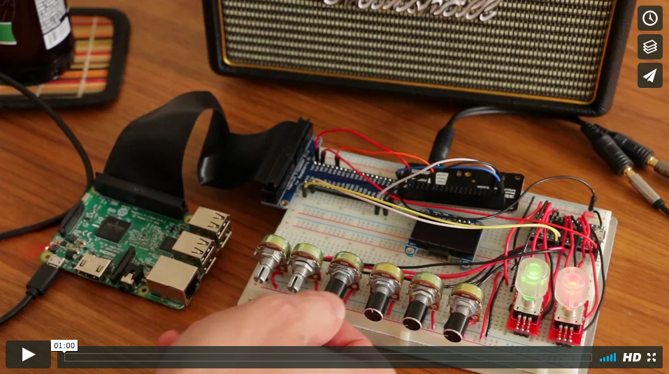

# 30DaysOfInstruments

[April 1st 2017 -- April 30th 2017]
-----------------------------------

For the month of April I challenged myself to create 30 instruments in 30 days. Included in this repo are the source files for the various days in multiple formats.

+ MaxMSP
+ Pure Data
+ Arduino C/C++
+ Physical patching of a modular synth

### Read the [Blog Post](https://medium.com/@KyleRStewart)

### Videos Posted on [Instagram](https://instagram.com/kylestew/) and [Vimeo](https://vimeo.com/user15124505)
